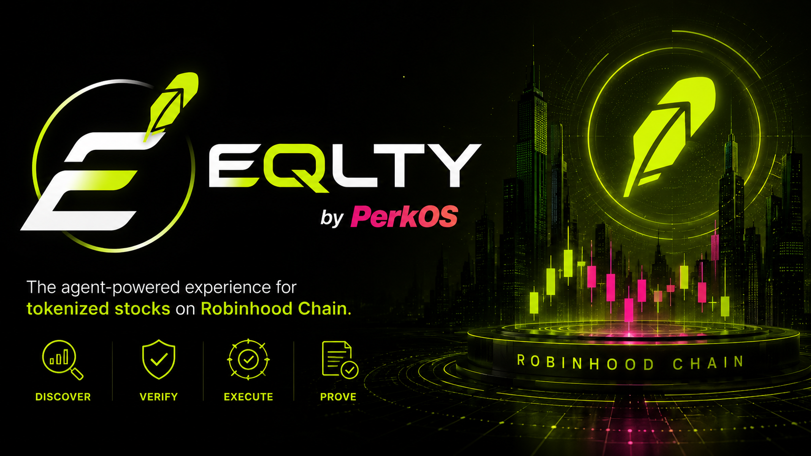
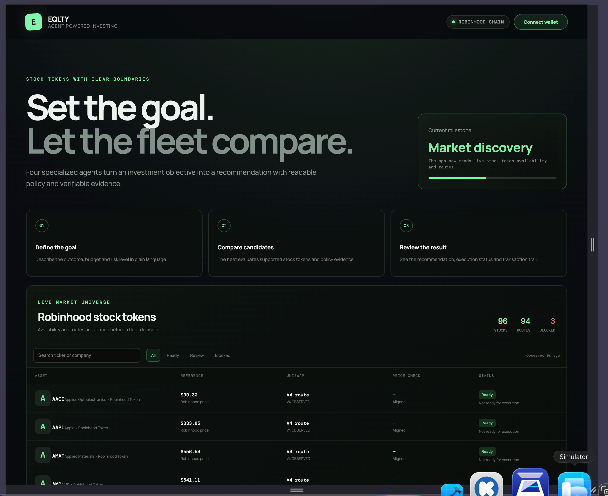
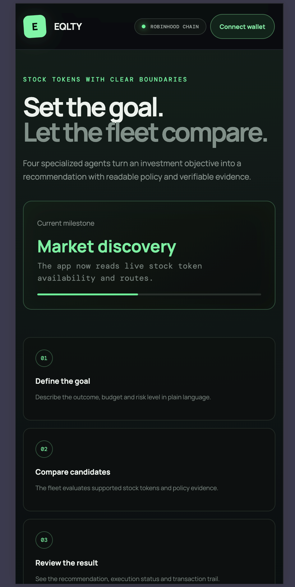
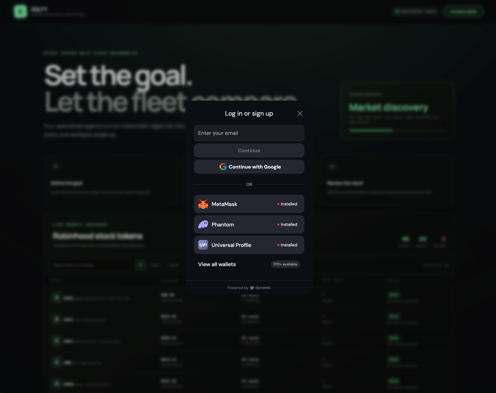

# EQLTY



EQLTY is an agent powered experience for discovering and buying tokenized
stocks on Robinhood Chain.

Users define an investment objective and a small fleet compares eligible
assets, checks policy and market evidence, prepares a guarded Uniswap trade,
and records a verifiable result. The product is designed for people who want
clear recommendations and bounded automation instead of a conventional
trading terminal.

## Product principles

- One goal should be easier to express than a complex order.
- Every agent should have a narrow responsibility.
- User policy should remain readable and independently verifiable.
- Automated execution should respect explicit spending and asset limits.
- Every recommendation and transaction should leave useful evidence.
- The mobile experience should be understandable without financial jargon.

## Agent fleet

EQLTY coordinates four specialized roles:

| Role | Responsibility |
|---|---|
| Scout | Discovers supported stock tokens and gathers market evidence |
| Risk | Checks policy, freshness, liquidity and execution limits |
| Trader | Prepares and executes an approved Uniswap trade |
| Auditor | Reconciles the decision with indexed transaction evidence |

The fleet uses PerkOS infrastructure for managed Hermes runtimes. Each runtime
can receive independent 1Claw security controls appropriate to its role.

## Sponsor integrations

The product focuses on three sponsor integrations:

- **Uniswap** provides stock token discovery, quotes and guarded execution.
- **The Graph** provides Substreams based evidence for market and transaction
  activity.
- **ENS** provides the public behavior and policy records used by the fleet.

### How we use Uniswap

- [`uniswap-client.ts`](API/src/uniswap-client.ts#L22) requests V4 exact input
  quotes from the Uniswap Trading API on Robinhood Chain.
- [`stock-catalog.ts`](API/src/stock-catalog.ts#L90) combines each quote with a
  reference price to score route deviation per candidate.
- [`proof-run.ts`](API/src/proof-run.ts#L220) keeps the routing, quoted output
  and request id inside the four agent proof bundle.
- [`EQLTYVault.sol`](Contracts/src/EQLTYVault.sol#L214) executes the approved
  route with per trade, total spend, slippage and deadline limits.
- [`uniswap-agent.mjs`](Plugins/EQLTY-Uniswap-Plugin/skills/execute-stock-token-trade/scripts/uniswap-agent.mjs#L103)
  packages quote review and guarded execution as a reusable agent skill.

### How we use The Graph

- [`lib.rs`](Plugins/EQLTY-The-Graph-Plugin/substreams/src/lib.rs#L13) is the
  parameterized Rust Substreams module that filters Uniswap V4 stock token
  pool events on Robinhood Chain.
- [`graph-evidence.ts`](API/src/graph-evidence.ts#L7) accepts only strict
  `the-graph-substreams` provenance for market evidence.
- [`graph-evidence.ts`](API/src/graph-evidence.ts#L77) validates ticker,
  freshness and block lag before evidence reaches the Risk role.
- [`proof-run.ts`](API/src/proof-run.ts#L210) is the Graph risk gate inside
  the four agent proof.
- [`stock-substreams.mjs`](Plugins/EQLTY-The-Graph-Plugin/skills/robinhood-stock-substreams/scripts/stock-substreams.mjs)
  exposes the 94 pool catalog, snapshots and direct streaming as an agent
  tool.

### How we use ENS

- [`ens-control-plane.ts`](API/src/ens-control-plane.ts#L37) resolves the
  owner, manifest and four role records that define fleet behavior.
- [`ens-policy.ts`](API/src/ens-policy.ts#L115) checks manifest expiry,
  version and settings hashes.
- [`durin-provisioner.ts`](API/src/durin-provisioner.ts#L49) provisions a
  Durin subname for each user fleet.
- [`ens-policy-preparation.ts`](API/src/ens-policy-preparation.ts#L67)
  prepares hash bound policy changes that wait for owner authorization.
- [`ens-fleet.mjs`](Plugins/EQLTY-ENS-Plugin/skills/ens-agent-fleet/scripts/ens-fleet.mjs#L93)
  is the reusable fleet directory and policy preset tool.

## Screenshots

| Stock Token catalog | Mobile experience | Wallet access |
|---|---|---|
|  |  |  |

## Repository map

```text
App/        User experience and wallet access
API/        Market, fleet and orchestration services
Contracts/  Onchain execution controls
Plugins/    Agent capabilities for sponsor integrations
docs/       Product and development documentation
```

The repository is being developed in small reviewable milestones. See
[the development plan](docs/PLAN.md) for the current direction,
[the integration map](docs/INTEGRATIONS.md) for implementation evidence and
[the demo guide](docs/DEMO.md) for the presentation flow.

## Local development

Install JavaScript dependencies from the repository root:

```bash
pnpm install
```

Run the app and API in separate terminals with `pnpm dev:app` and
`pnpm dev:api`. Use `pnpm check` for the shared type, format, build and test
gates. Foundry must be installed for contract checks.

## Security

Local environment files, credentials, private keys and deployment records are
excluded from version control. Examples may document variable names, but must
never contain live values.

Smart contracts and automated trading components are experimental software.
They should not be treated as financial advice or used with funds that cannot
be lost.
